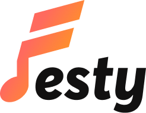
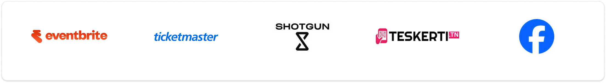
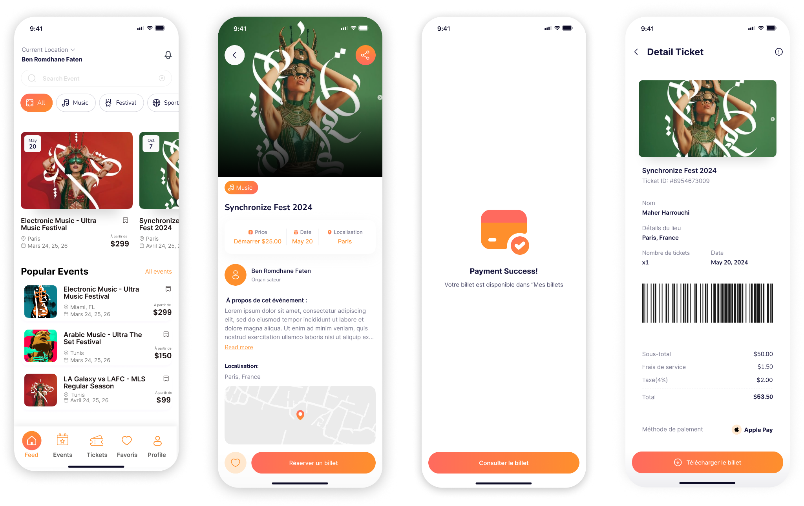
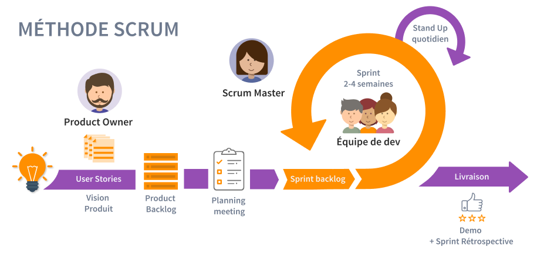

## Introduction

Ce chapitre présente le cadre général du projet réalisé dans le cadre de notre projet de fin d’études. Nous commençons par la présentation de l’organisme d’accueil, TEKSIGHT, en mettant en évidence son domaine d’activité, son positionnement technologique ainsi que son rôle dans l’accompagnement du projet. Ensuite, nous présentons le projet FESTY, son contexte, sa problématique, l’étude de l’existant, les limites relevées dans les solutions actuelles ainsi que la solution proposée.

Par la suite, nous exposons la méthodologie de travail adoptée pour la réalisation du projet. Étant donné la nature évolutive de l’application et la diversité de ses modules fonctionnels, nous avons opté pour une approche agile basée sur le framework Scrum. Enfin, nous présentons brièvement le langage de modélisation utilisé afin de structurer l’analyse et la conception du système.

## 1.1 Présentation de l’organisme d’accueil

Dans cette section, nous présentons l’organisme d’accueil au sein duquel notre projet de fin d’études a été réalisé. Cette présentation permet de situer le cadre professionnel du stage, de comprendre le domaine d’activité de l’entreprise et d’expliquer son rôle dans la réalisation du projet FESTY.

### 1.1.1 Présentation de TEKSIGHT

TEKSIGHT est une société tunisienne spécialisée dans les activités informatiques et les services numériques. Elle intervient dans la conception, le développement et le déploiement de solutions technologiques destinées à accompagner la transformation digitale des entreprises. Son activité s’inscrit dans un contexte marqué par l’évolution rapide des technologies de l’information, la montée en puissance des applications web et mobiles, ainsi que le besoin croissant de solutions numériques adaptées aux exigences des clients.

La société est implantée au sein de la pépinière des entreprises située au campus universitaire de Zarroug à Gafsa. Cette localisation lui permet d’évoluer dans un environnement favorable à l’innovation, à la collaboration avec le milieu académique et au développement de projets technologiques. Le document de présentation de TEKSIGHT précise que l’entreprise est spécialisée dans les activités informatiques et qu’elle bénéficie d’un ancrage stratégique au cœur du campus universitaire de Zarroug à Gafsa.[REF-TEKSIGHT].

TEKSIGHT se positionne comme un acteur technologique régional qui contribue au développement de solutions numériques dans plusieurs domaines. Son expertise couvre notamment le développement web et mobile, les bases de données, les plateformes cloud et IoT, les systèmes embarqués ainsi que les infrastructures numériques. Le document fourni mentionne en particulier des domaines tels que le développement mobile, les systèmes embarqués, les bases de données, Firebase, Big Data et la cybersécurité.[REF-TEKSIGHT].

Figure 1.1 : Logo de TEKSIGHT

### 1.1.2 Domaine d’activité et rôle dans le projet

Le domaine d’activité principal de TEKSIGHT est centré sur les services informatiques et les solutions numériques. L’entreprise accompagne ses clients dans la réalisation de projets technologiques en proposant des services liés au développement d’applications, à la gestion de données, à l’intégration de solutions digitales et à l’exploitation de technologies modernes.

Dans le cadre de notre projet de fin d’études, TEKSIGHT joue le rôle d’organisme d’accueil et d’encadrement technique. Elle a fourni le cadre professionnel nécessaire à la réalisation du projet, ainsi que l’accompagnement permettant de mieux comprendre les besoins du client, les contraintes techniques et les choix fonctionnels liés à l’application. Le projet FESTY, quant à lui, représente le besoin métier à satisfaire : la conception et le développement d’une application mobile multiplateforme dédiée à la gestion des événements.

Ainsi, il est important de distinguer entre TEKSIGHT, qui constitue l’organisme d’accueil du stage, et FESTY, qui représente le client et le projet métier autour duquel s’articule notre travail. Cette distinction permet de mieux comprendre le contexte global du projet : TEKSIGHT assure l’environnement technique et professionnel, tandis que FESTY porte le besoin fonctionnel lié à la digitalisation de la gestion événementielle.

Le tableau suivant résume les informations principales relatives à l’organisme d’accueil.

| Élément | Description |
|---|---|
| Dénomination sociale | Société TEKSIGHT |
| Domaine d’activité | Activités informatiques, services numériques et solutions IT |
| Localisation | Pépinière des entreprises, campus universitaire Zarroug, Gafsa |
| Identifiant fiscal | 1676402/B |
| Structure d’hébergement | Pépinière d’Entreprises de Gafsa |
| Type d’activité | Développement web et mobile, bases de données, solutions cloud, IoT et systèmes embarqués |
| Rôle dans le projet | Organisme d’accueil et accompagnement technique |
| Projet réalisé | FESTY, application mobile multiplateforme dédiée à la gestion des événements |

Tableau 1.1 : Présentation générale de TEKSIGHT

## 1.2 Présentation du projet FESTY

Dans cette section, nous présentons le projet FESTY, objet principal de notre projet de fin d’études. Nous commençons par exposer le contexte général dans lequel s’inscrit l’application, avant de préciser la problématique à résoudre. Ensuite, nous étudions quelques solutions existantes dans le domaine de la gestion événementielle afin d’identifier leurs limites et de justifier la solution proposée.

FESTY est une application mobile multiplateforme dédiée à la gestion des événements. Elle vise à centraliser, au sein d’une même plateforme, plusieurs services liés à la découverte d’événements, à la billetterie, à la communication entre participants, à la revente sécurisée de billets et au suivi des activités par les organisateurs. Le projet est réalisé pour le compte du client FESTY, avec l’accompagnement technique de TEKSIGHT.

Figure 1.2 : Logo de l’application FESTY
### 1.2.1 Contexte du projet

Le secteur événementiel connaît aujourd’hui une transformation importante portée par la digitalisation des services. Les événements culturels, artistiques, musicaux ou communautaires nécessitent de plus en plus des outils numériques capables de faciliter la communication entre les organisateurs et le public. Les utilisateurs souhaitent découvrir rapidement les événements qui les intéressent, consulter les informations essentielles, acheter leurs billets en ligne et recevoir des notifications liées aux mises à jour importantes.

De leur côté, les organisateurs ont besoin de solutions efficaces pour créer, gérer et promouvoir leurs événements. La gestion manuelle ou dispersée de ces activités peut entraîner plusieurs difficultés, notamment la perte de temps, le manque de visibilité sur les ventes, la difficulté à communiquer avec les participants et l’absence d’indicateurs fiables pour suivre la performance des événements.

Dans ce contexte, les plateformes numériques jouent un rôle essentiel dans l’amélioration de l’expérience utilisateur et dans l’optimisation de la gestion événementielle. Elles permettent de centraliser les informations, d’automatiser certaines tâches, de sécuriser les transactions et d’offrir aux organisateurs des outils d’analyse et de suivi. Toutefois, les besoins du marché ne se limitent plus à la simple vente de billets. Les utilisateurs recherchent également une expérience plus interactive, intégrant la communication, les notifications, la gestion des billets et la possibilité de revendre un billet de manière sécurisée.

C’est dans ce cadre que s’inscrit le projet FESTY. Il vise à proposer une application mobile multiplateforme permettant de répondre aux besoins des participants, des partenaires et des administrateurs à travers une solution intégrée, moderne et adaptée à la gestion des événements.

### 1.2.2 Problématique

Malgré l’existence de plusieurs plateformes dédiées à la billetterie ou à la promotion des événements, la gestion événementielle reste souvent fragmentée. Certaines solutions se concentrent principalement sur la vente de billets, tandis que d’autres privilégient la découverte ou la communication autour des événements. Cette dispersion oblige les organisateurs à utiliser plusieurs outils séparés pour gérer la création d’événements, la vente de billets, la communication avec les participants et le suivi des statistiques.

Du point de vue des utilisateurs, cette fragmentation peut rendre l’expérience moins fluide. Un participant peut être amené à consulter une plateforme pour découvrir un événement, une autre pour acheter son billet, puis un autre canal pour recevoir des informations ou communiquer avec d’autres participants. De plus, lorsqu’un utilisateur ne peut plus assister à un événement, la revente de son billet peut devenir risquée si elle se fait en dehors d’un cadre sécurisé.

Du point de vue des organisateurs, les limites concernent surtout le manque de centralisation et de visibilité. En l’absence d’un outil complet, il devient difficile de suivre les ventes en temps réel, d’analyser la participation, de gérer les billets, de communiquer directement avec les participants et de contrôler les opérations liées à l’événement.

La problématique principale de notre projet peut donc être formulée comme suit :

**Comment concevoir et développer une application mobile multiplateforme permettant de centraliser la découverte, la gestion, la billetterie, la communication et la revente sécurisée des billets d’événements, tout en offrant aux organisateurs des outils de suivi et d’analyse efficaces ?**

Pour répondre à cette problématique, nous proposons FESTY, une solution intégrée visant à améliorer à la fois l’expérience des participants et la gestion des événements par les partenaires.

### 1.2.3 Étude de l’existant

L’étude de l’existant constitue une étape importante dans la compréhension du domaine de la gestion événementielle. Elle permet d’identifier les solutions déjà présentes sur le marché, d’analyser leurs fonctionnalités principales et de relever les limites qui peuvent justifier la conception d’une nouvelle solution. Dans le cadre de notre projet, nous nous intéressons aux plateformes permettant la découverte, la promotion, la billetterie ou la gestion d’événements.

Parmi les solutions existantes, nous pouvons citer Eventbrite [REF-EVENTBRITE], Ticketmaster [REF-TICKETMASTER], Shotgun [REF-SHOTGUN], Teskerti [REF-TESKERTI] et Facebook Events [REF-FACEBOOK-EVENTS]. Ces plateformes proposent chacune des services liés aux événements, mais avec des orientations différentes. Certaines se concentrent principalement sur la billetterie, d’autres sur la découverte sociale ou sur des catégories spécifiques d’événements.

Figure 1.3 : Exemples de solutions existantes dans le domaine événementiel

**Eventbrite** est une plateforme internationale permettant aux organisateurs de créer, promouvoir et gérer des événements. Elle propose des fonctionnalités de billetterie en ligne, de suivi des ventes et d’inscription des participants.

**Ticketmaster** est une solution largement utilisée dans le domaine de la billetterie pour les concerts, spectacles, événements sportifs et grands événements. Elle offre un système de vente de billets structuré et une forte visibilité auprès du public.

**Shotgun** est une plateforme orientée principalement vers les événements musicaux, les soirées et les festivals. Elle permet aux utilisateurs de découvrir des événements, d’acheter des billets et d’accéder à certaines fonctionnalités communautaires.

**Teskerti** est une plateforme tunisienne de billetterie en ligne. Elle permet aux utilisateurs d’acheter des billets pour différents types d’événements locaux, notamment des concerts, spectacles et manifestations culturelles.

**Facebook Events** permet aux utilisateurs de découvrir, créer et partager des événements à travers un réseau social. Cette solution favorise la visibilité et la diffusion sociale des événements, mais elle reste limitée en matière de billetterie avancée et de gestion professionnelle.

Le tableau suivant présente une comparaison entre ces solutions selon plusieurs critères fonctionnels importants pour notre projet.

| Critère | Eventbrite | Ticketmaster | Shotgun | Teskerti | Facebook Events | FESTY |
|---|---|---|---|---|---|---|
| Découverte d’événements | Oui | Oui | Oui | Oui | Oui | Oui |
| Création d’événements | Oui | Limitée | Oui | Limitée | Oui | Oui |
| Application mobile | Oui | Oui | Oui | Variable | Oui | Oui |
| Billetterie en ligne | Oui | Oui | Oui | Oui | Non native | Oui |
| Paiement en ligne | Oui | Oui | Oui | Oui | Non natif | Oui |
| Génération de billets numériques | Oui | Oui | Oui | Oui | Non | Oui |
| Validation par QR code | Oui | Oui | Oui | Variable | Non | Oui |
| Revente encadrée de billets | Partielle | Selon les marchés | Variable | Limitée | Non | Oui |
| Chat communautaire lié à l’événement | Non | Non | Limité | Non | Discussion indirecte | Oui |
| Notifications personnalisées | Oui | Oui | Oui | Variable | Oui | Oui |
| Dashboard organisateur | Oui | Oui | Oui | Limité | Limité | Oui |
| Statistiques et analytics | Oui | Oui | Oui | Limité | Limité | Oui |
| Adaptation au marché local/arabe | Limitée | Limitée | Limitée | Partielle | Générale | Oui |

Tableau 1.2 : Comparaison des solutions existantes

### 1.2.4 Critique de l’existant

L’analyse des solutions existantes montre que le marché propose déjà plusieurs plateformes efficaces pour la découverte d’événements ou la vente de billets. Toutefois, ces solutions présentent certaines limites lorsqu’il s’agit de couvrir l’ensemble du cycle de gestion événementielle dans une seule application intégrée.

Sur le plan fonctionnel, plusieurs plateformes se concentrent principalement sur la billetterie ou la promotion des événements. Elles ne proposent pas toujours une gestion complète incluant la communication entre participants, la revente sécurisée, les notifications personnalisées, la validation des billets et le suivi statistique des activités. Cette spécialisation peut obliger les organisateurs à combiner plusieurs outils pour gérer un même événement.

Sur le plan de l’expérience utilisateur, certaines solutions offrent un parcours fragmenté. L’utilisateur peut découvrir un événement sur une plateforme, acheter son billet sur une autre, puis utiliser un canal externe pour recevoir des informations ou communiquer avec d’autres participants. Cette dispersion réduit la fluidité de l’expérience et peut générer une perte d’informations.

La revente des billets constitue également une limite importante. Lorsqu’elle n’est pas encadrée par la plateforme, elle peut exposer les utilisateurs à des risques de fraude, de duplication ou de transfert non contrôlé. Une solution événementielle moderne doit donc intégrer un mécanisme sécurisé permettant de gérer cette revente dans un cadre fiable.

Du côté des organisateurs, les limites concernent principalement le manque de centralisation des données et des outils de suivi. Certaines plateformes proposent des tableaux de bord, mais ceux-ci restent parfois limités ou insuffisamment adaptés aux besoins des partenaires qui souhaitent suivre les ventes, analyser la participation, gérer les billets et communiquer avec les utilisateurs.

Enfin, plusieurs solutions internationales ne sont pas spécifiquement adaptées au contexte local ou régional, notamment lorsqu’il s’agit de valoriser des événements culturels, artistiques ou communautaires destinés à un public arabe. Cette limite ouvre la voie à une solution plus ciblée, capable de combiner les fonctionnalités essentielles de la gestion événementielle avec une expérience mieux adaptée aux besoins des utilisateurs et des organisateurs.

Ces constats justifient la mise en place de FESTY, une solution intégrée visant à centraliser la découverte, la gestion, la billetterie, la communication, la revente sécurisée et le suivi analytique des événements.

### 1.2.5 Solution proposée

Afin de répondre aux limites relevées dans les solutions existantes, nous proposons FESTY, une application mobile multiplateforme dédiée à la gestion des événements. Cette solution vise à centraliser les principales fonctionnalités nécessaires aux participants, aux partenaires organisateurs et aux administrateurs au sein d’une même plateforme.

FESTY permet aux utilisateurs de découvrir des événements, de consulter leurs détails, d’acheter des billets numériques, de recevoir des notifications et de participer à un espace de communication lié à chaque événement. L’application intègre également un mécanisme de revente sécurisée permettant aux utilisateurs de revendre leurs billets dans un cadre contrôlé, afin de limiter les risques de fraude ou de duplication.

Du côté des partenaires, FESTY propose des outils permettant de créer et gérer des événements, de suivre les ventes, de consulter les statistiques et de gérer les billets associés à chaque événement. Ces fonctionnalités permettent aux organisateurs de disposer d’une meilleure visibilité sur leurs activités et de piloter leurs événements de manière plus efficace.

La solution prévoit également une interface d’administration destinée à superviser la plateforme, gérer les utilisateurs, contrôler les événements et assurer le bon fonctionnement global du système. Cette organisation permet de répondre aux besoins des différents acteurs tout en assurant une séparation claire des rôles et des responsabilités.

Sur le plan technique, FESTY repose sur une application mobile développée avec Flutter, un backend basé sur Java et Spring Framework, une interface web réalisée avec React, ainsi qu’une base de données PostgreSQL. La solution intègre également des services externes pour la gestion du paiement, le stockage des médias et l’envoi de notifications. Ces choix techniques permettent de construire une application évolutive, sécurisée et adaptée aux besoins d’une plateforme événementielle moderne.

Ainsi, FESTY se distingue par son approche intégrée. Contrairement aux solutions qui se concentrent uniquement sur la billetterie ou la promotion, notre application vise à couvrir l’ensemble du cycle événementiel : découverte, gestion, achat de billets, validation, communication, revente sécurisée, suivi statistique et administration.

Figure 1.4 : Aperçu général de l’application FESTY

## 1.3 Méthodologie de travail

La réussite d’un projet informatique ne dépend pas uniquement des choix techniques, mais aussi de la méthode adoptée pour organiser le travail, gérer les priorités et suivre l’avancement du développement. Dans le cadre du projet FESTY, l’application à développer comporte plusieurs modules fonctionnels : gestion des utilisateurs, gestion des événements, billetterie, paiement en ligne, validation des billets, notifications, chat, revente sécurisée, tableau de bord partenaire et administration.

Cette diversité fonctionnelle rend nécessaire l’adoption d’une méthode de travail flexible, capable de s’adapter aux changements, de faciliter le découpage du projet et de permettre une réalisation progressive. Pour cette raison, nous avons opté pour une approche agile basée sur le framework Scrum. 

### 1.3.1 Choix de l’approche agile

Les méthodes classiques de gestion de projet, telles que le modèle en cascade ou le cycle en V, reposent généralement sur une organisation séquentielle. Chaque phase doit être terminée avant le passage à la suivante : analyse, conception, développement, test puis livraison. Bien que ces méthodes puissent être adaptées à certains projets stables, elles présentent des limites lorsqu’il s’agit d’un projet évolutif dont les besoins peuvent être ajustés progressivement.

Dans le cas de FESTY, le projet regroupe plusieurs fonctionnalités interdépendantes et nécessite une adaptation continue aux besoins du client. Une méthode rigide aurait rendu plus difficile l’intégration progressive des modules et la prise en compte des retours obtenus durant le développement.

L’approche agile permet, au contraire, de diviser le projet en plusieurs itérations courtes, appelées sprints. Chaque sprint a pour objectif de produire un ensemble de fonctionnalités cohérentes et testables. Cette organisation facilite le suivi de l’avancement, la gestion des priorités et l’amélioration progressive de la solution.

Ainsi, l’approche agile constitue un choix pertinent pour notre projet, car elle favorise la flexibilité, la collaboration, l’adaptation aux changements et la livraison progressive des fonctionnalités.

### 1.3.2 Présentation du framework Scrum

Scrum est un framework agile utilisé pour gérer des projets complexes de manière itérative et incrémentale [REF-SCRUM]. Il repose sur le découpage du travail en sprints, durant lesquels l’équipe se concentre sur un ensemble de tâches définies à partir du backlog produit. À la fin de chaque sprint, un incrément fonctionnel peut être évalué, testé et amélioré.

Scrum s’appuie principalement sur trois éléments : les rôles, les événements et les artefacts.

Les principaux rôles Scrum sont :

- **Product Owner** : il représente les besoins du client et définit les priorités fonctionnelles du produit.
- **Scrum Master** : il veille au bon déroulement de la méthode Scrum, facilite l’organisation du travail et aide à résoudre les obstacles rencontrés.
- **Development Team** : elle est chargée de concevoir, développer, tester et livrer les fonctionnalités prévues.

Scrum définit également plusieurs événements permettant d’organiser le travail :

- **Sprint Planning** : réunion de planification durant laquelle les tâches du sprint sont sélectionnées.
- **Daily Scrum** : réunion courte permettant de suivre l’avancement quotidien et d’identifier les difficultés.
- **Sprint Review** : réunion de fin de sprint permettant de présenter l’incrément réalisé.
- **Sprint Retrospective** : réunion permettant d’analyser le déroulement du sprint et de proposer des améliorations.

Enfin, Scrum repose sur des artefacts essentiels :

- **Product Backlog** : liste priorisée des fonctionnalités à développer.
- **Sprint Backlog** : ensemble des tâches sélectionnées pour un sprint donné.
- **Increment** : résultat fonctionnel produit à la fin d’un sprint.

Figure 1.5 : Processus Scrum

### 1.3.3 Application de Scrum dans le projet

Dans le cadre de notre projet, Scrum a été adapté à un contexte de travail individuel. Même si le développement a été réalisé par un seul stagiaire, les principes de Scrum ont permis d’organiser efficacement le travail et de structurer l’avancement du projet.

Les fonctionnalités de FESTY ont été découpées en modules indépendants afin de faciliter leur planification et leur réalisation progressive. Chaque module a été traité comme un ensemble de tâches à accomplir, en tenant compte de son importance fonctionnelle et de sa dépendance avec les autres modules.

Le backlog produit a permis de regrouper les fonctionnalités principales de l’application, notamment l’authentification, la gestion des événements, l’achat des billets, le paiement en ligne, la validation par QR code, les notifications, le chat, la revente sécurisée, le tableau de bord partenaire et l’administration.

L’application de Scrum a permis de mieux gérer la complexité du projet, de prioriser les fonctionnalités essentielles et de suivre l’évolution de la solution tout au long de la période de stage. La planification détaillée des sprints et la répartition des fonctionnalités seront présentées dans les chapitres suivants.

## 1.4 Langage de modélisation

La modélisation constitue une étape importante dans le développement d’un système informatique, car elle permet de représenter clairement les fonctionnalités, les interactions et la structure générale de l’application avant sa réalisation. Dans le cadre de notre projet, nous avons adopté le langage UML, Unified Modeling Language, comme langage de modélisation.

UML est un langage standard utilisé pour analyser, concevoir et documenter les systèmes logiciels [REF-UML]. Il permet de représenter le système sous plusieurs angles, notamment l’aspect fonctionnel, comportemental et structurel. Grâce à cette approche, il devient plus facile de comprendre les besoins du projet, d’identifier les acteurs impliqués et de décrire les interactions entre les différents composants de l’application.

Dans notre projet FESTY, UML sera utilisé principalement pour représenter les cas d’utilisation, décrire les scénarios fonctionnels et modéliser certains enchaînements à travers des diagrammes de séquence. Ces représentations permettront de mieux structurer l’analyse et la conception de l’application avant la phase de réalisation.

Ainsi, le recours à UML facilite la communication autour du projet, améliore la compréhension du système et constitue un support essentiel pour la documentation technique de la solution.

## Conclusion

Dans ce chapitre, nous avons présenté le cadre général de notre projet de fin d’études. Nous avons commencé par introduire l’organisme d’accueil, TEKSIGHT, en précisant son domaine d’activité, son environnement technologique et son rôle dans l’accompagnement du projet. Nous avons ensuite présenté le projet FESTY, une application mobile multiplateforme dédiée à la gestion des événements.

L’étude du contexte nous a permis de mettre en évidence les besoins liés à la digitalisation du secteur événementiel. Nous avons également analysé plusieurs solutions existantes afin d’identifier leurs limites, notamment la fragmentation des services, le manque de centralisation, les limites liées à la revente sécurisée des billets et l’insuffisance de certains outils destinés aux organisateurs. À partir de cette analyse, nous avons proposé FESTY comme une solution intégrée couvrant la découverte, la gestion, la billetterie, la communication, la revente sécurisée et le suivi statistique des événements.

Nous avons aussi présenté la méthodologie de travail adoptée, à savoir le framework Scrum, choisi pour sa flexibilité et son adaptation aux projets évolutifs. Enfin, nous avons introduit UML comme langage de modélisation utilisé pour structurer l’analyse et la conception de notre système.

Le chapitre suivant sera consacré à la préparation du projet. Nous y présenterons l’analyse et la spécification des besoins, l’identification des acteurs, le backlog du produit, la planification des sprints, l’environnement de travail, les technologies utilisées ainsi que l’architecture générale de la solution.
