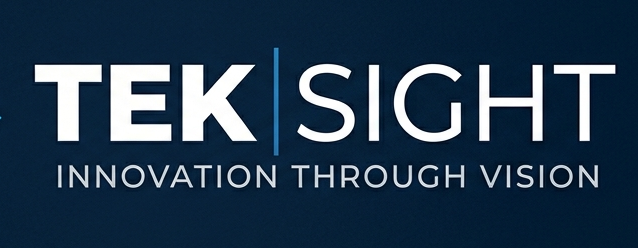

# Chapitre 1 : Contexte général du projet

## Introduction

Ce chapitre présente le cadre général du projet FESTY. Il introduit l’organisme d’accueil, le contexte du projet, la problématique, l’étude de l’existant ainsi que la solution proposée. Il présente également la méthodologie de travail adoptée et la planification prévisionnelle du projet.

## 1.1 Présentation de l’organisme d’accueil

Cette section présente l’organisme d’accueil dans lequel le projet de fin d’études a été réalisé, ainsi que son domaine d’activité et son rôle dans l’accompagnement du projet FESTY.

### 1.1.1 Présentation de TEKSIGHT

TEKSIGHT est une société tunisienne spécialisée dans les services informatiques et les solutions numériques. Elle accompagne ses clients dans la conception, le développement et le déploiement de solutions technologiques adaptées à leurs besoins.

L’entreprise est implantée à la pépinière des entreprises du campus universitaire Zarroug à Gafsa. Cette implantation lui permet d’évoluer dans un environnement favorable à l’innovation, à l’entrepreneuriat et à la collaboration avec le milieu universitaire.

**Figure 1.1 : Logo de TEKSIGHT**

### 1.1.2 Domaine d’activité

TEKSIGHT exerce principalement dans le domaine des technologies de l’information. Ses activités couvrent notamment le développement d’applications web et mobiles, la conception de bases de données, l’intégration de solutions cloud, l’Internet des objets et les systèmes embarqués.

Grâce à ces compétences, l’entreprise contribue à la réalisation de solutions numériques destinées à améliorer les processus métier et à répondre aux besoins techniques de ses clients.

### 1.1.3 Rôle de TEKSIGHT dans le projet

Dans le cadre de ce projet de fin d’études, TEKSIGHT a assuré l’encadrement technique et le suivi du développement de FESTY. Elle a fourni le cadre professionnel nécessaire à la réalisation du projet et a contribué au suivi des choix fonctionnels et techniques de l’application.

FESTY représente le projet applicatif à développer. Il s’agit d’une plateforme mobile dédiée à la gestion des événements, réalisée avec l’accompagnement technique de TEKSIGHT.

| Élément | Description |
|---|---|
| Dénomination sociale | TEKSIGHT |
| Domaine d’activité | Services informatiques et solutions numériques |
| Localisation | Pépinière des entreprises, campus universitaire Zarroug, Gafsa |
| Activités principales | Développement web et mobile, bases de données, cloud, IoT et systèmes embarqués |
| Rôle dans le projet | Organisme d’accueil et encadrement technique |
| Projet réalisé | FESTY, application mobile dédiée à la gestion des événements |

**Tableau 1.1 : Présentation générale de TEKSIGHT**

## 1.2 Présentation du projet FESTY

Cette section présente le projet FESTY, son contexte, sa problématique ainsi que les objectifs visés par la solution proposée.

### 1.2.1 Contexte du projet

Le secteur événementiel connaît une évolution importante grâce à la digitalisation des services. Les utilisateurs cherchent aujourd’hui à découvrir facilement les événements, consulter leurs détails, acheter leurs billets en ligne et recevoir des informations en temps réel.

De leur côté, les organisateurs ont besoin d’outils numériques leur permettant de créer, gérer et suivre leurs événements de manière efficace. Cette évolution met en évidence la nécessité de disposer d’une solution centralisée capable de répondre aux besoins des participants, des organisateurs et des administrateurs.

Dans ce contexte, le projet FESTY consiste à concevoir et développer une application mobile multiplateforme dédiée à la gestion des événements.

### 1.2.2 Problématique

Malgré l’existence de plusieurs solutions de billetterie et de gestion événementielle, les services proposés restent souvent dispersés. L’utilisateur doit parfois utiliser plusieurs plateformes pour découvrir un événement, acheter un billet, suivre les mises à jour ou interagir avec les autres participants.

Cette fragmentation complique également le travail des organisateurs, qui ont besoin de gérer les événements, les billets, le contrôle d’accès et le suivi de l’activité depuis un même espace. À cela s’ajoutent des besoins importants liés à la sécurité des billets, à la traçabilité des paiements et à la supervision des opérations sensibles.

La problématique principale peut donc être formulée ainsi :

> Comment concevoir une plateforme mobile centralisée permettant de simplifier la découverte, la réservation, la gestion et le contrôle des événements, tout en assurant une expérience sécurisée pour les utilisateurs, les partenaires et les administrateurs ?

### 1.2.3 Objectifs du projet

L’objectif principal du projet FESTY est de mettre en place une plateforme mobile permettant de centraliser les services liés à la gestion événementielle.

Les objectifs spécifiques du projet sont les suivants :

* faciliter la découverte des événements et des artistes ;
* permettre aux utilisateurs de réserver et gérer leurs billets ;
* offrir aux partenaires un espace de gestion de leurs événements ;
* assurer le contrôle d’accès aux événements à travers le scan des billets ;
* permettre le suivi des activités et des opérations financières ;
* fournir à l’administrateur un espace de supervision et de modération.

Ainsi, FESTY vise à améliorer l’expérience des participants, à simplifier le travail des organisateurs et à renforcer la sécurité des opérations liées aux événements.

## 1.3 Étude de l’existant

Cette section présente les solutions existantes dans le domaine de la gestion événementielle, puis identifie leurs limites afin de justifier la solution proposée.

### 1.3.1 Description de l’existant

Aujourd’hui, plusieurs solutions numériques permettent de gérer certains aspects liés aux événements. Certaines plateformes sont spécialisées dans la publication et la promotion des événements, tandis que d’autres se concentrent sur la vente de billets en ligne ou sur la communication avec les participants.

Cependant, ces solutions couvrent souvent une partie limitée du processus événementiel. L’utilisateur peut découvrir un événement sur une plateforme, acheter son billet sur une autre, recevoir les informations ailleurs, puis présenter son billet à travers un système différent lors de l’accès à l’événement.

Du côté des organisateurs, la gestion peut également être dispersée entre plusieurs outils : création de l’événement, suivi des ventes, communication avec les participants, contrôle des billets et suivi financier.

| Type de solution existante            | Fonctionnalités principales                                |
| ------------------------------------- | ---------------------------------------------------------- |
| Plateformes de billetterie            | Vente de billets, paiement en ligne, génération de tickets |
| Plateformes de promotion d’événements | Publication d’événements, recherche, visibilité            |
| Réseaux sociaux                       | Communication, partage, interaction avec le public         |
| Outils de contrôle d’accès            | Scan des billets, validation des entrées                   |
| Outils de gestion interne             | Suivi des ventes, statistiques, gestion des participants   |

**Tableau 1.2 : Synthèse des solutions existantes**

### 1.3.2 Critique de l’existant

Malgré leur utilité, les solutions existantes présentent plusieurs limites. La première limite concerne la fragmentation des services. En effet, les fonctionnalités nécessaires à la gestion complète d’un événement ne sont pas toujours centralisées dans une seule plateforme.

La deuxième limite concerne l’expérience utilisateur. L’utilisateur doit parfois passer par plusieurs outils pour découvrir un événement, acheter un billet, consulter ses informations ou suivre les mises à jour.

Du côté des organisateurs, les outils existants ne permettent pas toujours de gérer efficacement l’ensemble du cycle de vie d’un événement, depuis sa création jusqu’au contrôle d’accès et au suivi financier.

Enfin, certaines solutions ne proposent pas suffisamment de mécanismes liés à la personnalisation, à la revente sécurisée des billets, à la traçabilité des opérations ou à la supervision administrative.

### 1.3.3 Solution proposée

Pour répondre à ces limites, nous proposons **FESTY**, une application mobile multiplateforme dédiée à la gestion des événements. Elle vise à centraliser les principales fonctionnalités nécessaires aux utilisateurs, aux partenaires, aux agents de scan et aux administrateurs.

La solution permet aux utilisateurs de découvrir les événements, consulter les artistes associés, gérer leurs billets et interagir autour des événements. Elle offre également aux partenaires un espace de gestion de leurs événements, de leurs billets, du contrôle d’accès et du suivi de leur activité.

De plus, FESTY intègre un espace d’administration permettant de superviser la plateforme, gérer les utilisateurs et partenaires, modérer les contenus, suivre les opérations financières et assurer la traçabilité des actions sensibles.

Ainsi, FESTY se présente comme une solution centralisée visant à améliorer l’expérience des participants, simplifier le travail des organisateurs et renforcer la sécurité de la gestion événementielle.

## 1.4 Méthodologie de travail

Le choix d’une méthodologie de travail adaptée permet d’organiser les différentes étapes du projet et de mieux suivre son avancement. Dans le cadre du projet FESTY, nous avons comparé les approches classiques et les approches agiles afin de retenir la méthode la plus adaptée à la nature modulaire de la plateforme.

### 1.4.1 Comparaison des méthodologies

Les méthodes classiques, telles que le modèle en cascade ou le cycle en V, reposent sur une succession de phases prédéfinies. Elles conviennent aux projets dont les besoins sont clairement définis dès le départ, mais elles offrent peu de flexibilité lorsque les exigences évoluent durant la réalisation.

Les méthodes agiles, quant à elles, favorisent un développement itératif et incrémental. Elles permettent de livrer progressivement des fonctionnalités, d’intégrer les retours au fur et à mesure et de mieux s’adapter aux changements.

| Critère | Méthodes classiques | Méthodes agiles |
|---|---|---|
| Organisation | Séquentielle | Itérative et incrémentale |
| Définition des besoins | Fixée dès le début | Évolutive |
| Livraison | Généralement en fin de projet | Progressive |
| Tests | Après le développement | À chaque itération |
| Adaptation aux changements | Limitée | Élevée |
| Suivi du projet | Par phase | Par itération |

**Tableau 1.3 : Comparaison entre les méthodes classiques et les méthodes agiles**

### 1.4.2 Comparaison des frameworks agiles

Parmi les approches agiles, plusieurs frameworks peuvent être utilisés selon la nature du projet. Le tableau suivant présente une comparaison synthétique entre Scrum, Kanban et XP.

| Critère | Scrum | Kanban | XP |
|---|---|---|---|
| Organisation | Sprints | Flux continu | Itérations courtes |
| Rôles | Product Owner, Scrum Master, équipe de développement | Rôles non imposés | Équipe de développement |
| Suivi | Sprint Planning, Review, Retrospective | Tableau de flux | Pratiques techniques régulières |
| Point fort | Structure claire et livraison incrémentale | Grande flexibilité dans la gestion du flux | Amélioration de la qualité du code |
| Limite | Nécessite une bonne organisation des sprints | Moins adapté si le projet est déjà découpé en modules | Plus centré sur les pratiques de développement que sur la gestion globale |
| Adaptation à FESTY | Très adaptée : projet structuré en modules et sprints | Moyennement adaptée : besoin de lots fonctionnels | Moins adaptée : besoin d’une organisation globale |

**Tableau 1.4 : Comparaison entre quelques frameworks agiles**

### 1.4.3 Choix de Scrum

D’après les comparaisons précédentes, nous avons retenu Scrum comme framework de travail. Ce choix s’explique par la nature du projet FESTY, qui regroupe plusieurs modules fonctionnels à développer progressivement, notamment l’authentification, l’exploration des événements, la billetterie, l’espace partenaire, le contrôle d’accès, le suivi financier et l’administration.

Scrum permet de structurer le développement en sprints. Chaque sprint regroupe un ensemble cohérent de fonctionnalités et aboutit à un incrément fonctionnel. Cette organisation facilite le découpage du projet, le suivi de l’avancement et l’intégration progressive des différentes parties de la plateforme.

### 1.4.4 Présentation synthétique de Scrum

Scrum est un framework agile qui organise le développement d’un produit en cycles courts appelés sprints. Il repose principalement sur des rôles, des événements et des artefacts permettant de suivre l’évolution du projet et de livrer progressivement des fonctionnalités exploitables.

Dans ce rapport, l’application concrète de Scrum sera détaillée dans le chapitre suivant à travers la définition de l’équipe, du backlog produit et de la planification des sprints.

## 1.5 Planification prévisionnelle

La planification prévisionnelle permet d’avoir une vision globale sur le déroulement du projet durant la période de réalisation. Elle présente les principales étapes suivies, depuis l’étude du contexte jusqu’à la rédaction du rapport, en passant par l’analyse, la conception, le développement, les tests et la validation.

Dans le cadre du projet FESTY, nous avons utilisé un diagramme de Gantt afin de représenter l’enchaînement des différentes phases du projet et leur répartition dans le temps.

Ce diagramme de Gantt est utilisé comme outil de visualisation globale du déroulement du projet. Il ne constitue pas un artefact Scrum, mais permet de représenter la planification prévisionnelle de la période de réalisation.

**Figure 1.2 : Diagramme de Gantt prévisionnel du projet FESTY**
## Conclusion

Dans ce chapitre, nous avons présenté le cadre général du projet FESTY. Nous avons commencé par introduire l’organisme d’accueil TEKSIGHT, puis nous avons exposé le contexte du projet, sa problématique, l’étude de l’existant ainsi que la solution proposée.

Nous avons également présenté la méthodologie de travail adoptée et la planification prévisionnelle du projet. Le chapitre suivant sera consacré à l’analyse et à la préparation du projet, à travers l’identification des acteurs, la spécification des besoins, le backlog produit, la planification des sprints et l’architecture générale de la solution.
