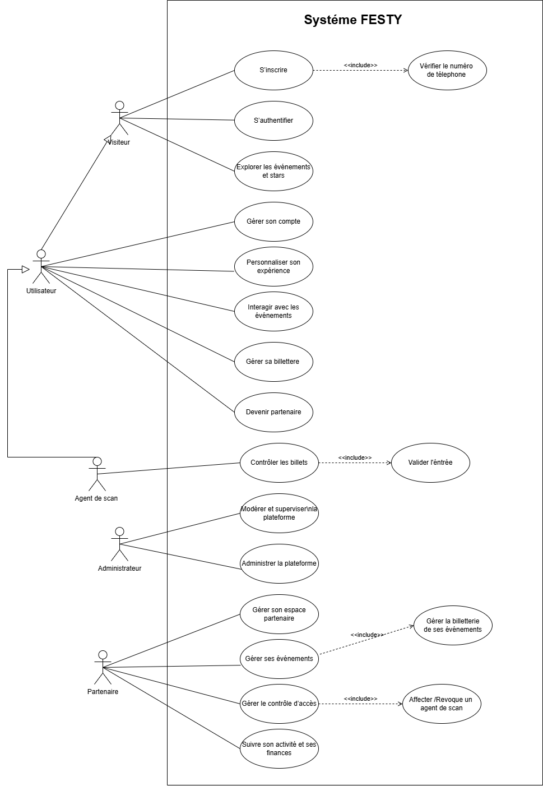
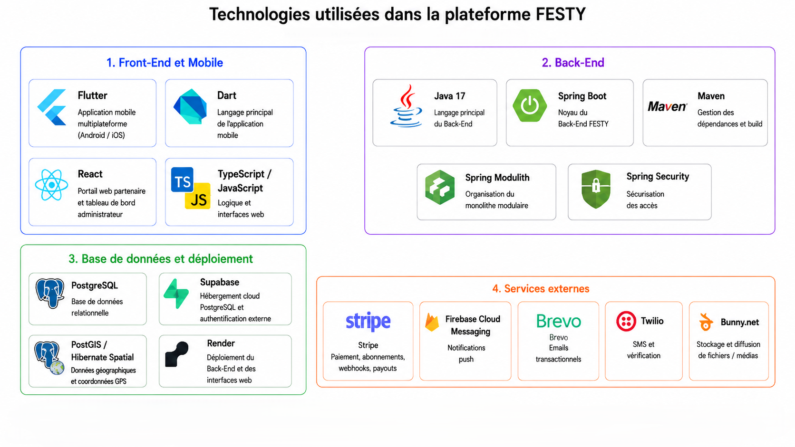

# Chapitre 2 : Analyse et préparation du projet

## Introduction

Ce chapitre présente la phase d’analyse et de préparation du projet **FESTY**. Il a pour objectif de définir les bases fonctionnelles, méthodologiques et techniques nécessaires à la réalisation de la plateforme.

Nous commençons par l’identification des différents acteurs qui interagissent avec le système. Ensuite, nous présentons les besoins fonctionnels et non fonctionnels afin de préciser les services attendus de l’application. Nous introduisons par la suite le diagramme de cas d’utilisation global, qui offre une vue synthétique des principales interactions entre les acteurs et la plateforme.

Dans un second temps, nous décrivons l’organisation du projet selon la méthodologie Scrum, à travers la définition des rôles, l’élaboration du backlog produit et la planification des sprints. Enfin, nous présentons l’environnement de travail, les technologies utilisées ainsi que l’architecture générale de la solution.

## 2.1 Identification des acteurs

L’identification des acteurs constitue une étape essentielle dans l’analyse fonctionnelle du système. Un acteur représente une entité externe qui interagit avec la plateforme afin d’atteindre un objectif précis. Dans le cadre du projet **FESTY**, les acteurs correspondent aux différents profils d’utilisateurs qui accèdent à l’application selon des rôles et des droits distincts.

La plateforme distingue cinq acteurs principaux : le **Visiteur**, l’**Utilisateur**, le **Partenaire**, l’**Agent de scan** et l’**Administrateur**.

| Acteur | Description |
|---|---|
| **Visiteur** | Représente une personne non authentifiée qui accède aux fonctionnalités publiques de la plateforme. Il peut consulter les événements, rechercher un événement, consulter le catalogue des stars, s’inscrire ou s’authentifier. |
| **Utilisateur** | Représente une personne authentifiée disposant d’un compte sur la plateforme. Il peut gérer son compte, personnaliser son expérience, gérer sa billetterie personnelle, interagir avec les événements et soumettre une candidature pour devenir partenaire. |
| **Partenaire** | Représente un organisateur d’événements. Il dispose d’un espace dédié lui permettant de gérer ses événements, ses sessions de scan, ses opérations financières et son tableau de bord. |
| **Agent de scan** | Représente un utilisateur affecté à un événement afin de contrôler les billets à l’entrée. Il peut consulter son contexte d’affectation, scanner un billet et valider l’entrée des participants. |
| **Administrateur** | Représente le responsable de supervision de la plateforme. Il assure la gestion des utilisateurs, la validation des partenaires, la modération de la plateforme, la supervision des opérations financières et la configuration globale du système. |

Dans notre modélisation, l’**Utilisateur** hérite des fonctionnalités du **Visiteur**, car un utilisateur authentifié peut également accéder aux fonctionnalités publiques telles que la consultation et la recherche des événements. De même, l’**Agent de scan** hérite des fonctionnalités de l’**Utilisateur**, puisqu’il s’agit d’un utilisateur disposant d’une affectation spécifique lui permettant de contrôler les billets lors d’un événement.

La généralisation entre Visiteur et Utilisateur est utilisée dans un sens fonctionnel : elle signifie qu’un utilisateur authentifié conserve l’accès aux fonctionnalités publiques du visiteur. Elle ne traduit pas nécessairement une relation de rôle technique dans le backend.

En revanche, le **Partenaire** et l’**Administrateur** sont considérés comme des rôles distincts. Le Partenaire possède des fonctionnalités liées à l’organisation et à la gestion des événements, tandis que l’Administrateur dispose de droits de supervision et de configuration sur l’ensemble de la plateforme.

## 2.2 Spécification des besoins

La spécification des besoins permet de définir les fonctionnalités attendues de la plateforme ainsi que les contraintes de qualité auxquelles le système doit répondre. Elle constitue une étape importante avant la conception, car elle permet de préciser le périmètre fonctionnel de l’application et d’orienter les choix techniques et architecturaux.

Dans le cadre du projet **FESTY**, les besoins sont classés en deux catégories : les besoins fonctionnels, qui décrivent les services fournis par la plateforme aux différents acteurs, et les besoins non fonctionnels, qui décrivent les exigences liées à la sécurité, la performance, la disponibilité, l’ergonomie et la maintenabilité du système.

### 2.2.1 Besoins fonctionnels

Les besoins fonctionnels représentent les actions que les acteurs peuvent effectuer à travers la plateforme. Dans cette section, nous présentons les principales fonctionnalités offertes par **FESTY** selon chaque acteur identifié.

| Acteur | Besoins fonctionnels principaux |
|---|---|
| **Visiteur** | S’inscrire, s’authentifier et explorer les événements et les stars. |
| **Utilisateur** | Gérer son compte, personnaliser son expérience, gérer sa billetterie personnelle, interagir avec les événements et devenir partenaire. |
| **Partenaire** | Gérer son espace partenaire, gérer ses événements, gérer le contrôle d’accès, suivre son activité et ses finances. |
| **Agent de scan** | Contrôler les billets à l’entrée des événements. |
| **Administrateur** | Administrer la plateforme, modérer et superviser la plateforme. |

Les besoins fonctionnels présentés dans ce tableau sont formulés à un niveau global afin de conserver une vision synthétique du système. Chaque besoin regroupe plusieurs sous-fonctionnalités qui seront détaillées dans les chapitres de sprint. Par exemple, le besoin « Gérer sa billetterie personnelle » englobe l’achat, la consultation, la revente et le suivi des billets. De même, le besoin « Modérer et superviser la plateforme » regroupe la modération des événements, des avis, des stars ainsi que la supervision des opérations sensibles.

### 2.2.2 Besoins non fonctionnels

Les besoins non fonctionnels décrivent les contraintes de qualité que doit respecter la plateforme **FESTY**. Ils ne correspondent pas directement à des fonctionnalités visibles par l’utilisateur, mais ils sont essentiels pour garantir la fiabilité, la sécurité et la bonne utilisation du système.

| Besoin non fonctionnel | Description |
|---|---|
| **Sécurité** | Le système doit protéger les comptes utilisateurs, les données personnelles, les billets numériques, les paiements et les accès aux fonctionnalités sensibles. Les opérations critiques doivent être accessibles uniquement aux acteurs autorisés. |
| **Performance** | La plateforme doit assurer un temps de réponse acceptable lors de la consultation des événements, de la recherche, de l’achat des billets, du paiement et du scan à l’entrée des événements. |
| **Disponibilité** | Les fonctionnalités principales de la plateforme doivent rester accessibles afin de garantir une expérience continue aux visiteurs, utilisateurs, partenaires et agents de scan. |
| **Ergonomie** | L’application doit proposer une interface claire, intuitive et adaptée à une utilisation mobile afin de faciliter la navigation et l’accès aux différentes fonctionnalités. |
| **Compatibilité** | La solution doit être compatible avec les plateformes mobiles ciblées et permettre une utilisation fluide sur différents appareils. |
| **Maintenabilité** | L’architecture doit faciliter l’évolution du système, l’ajout de nouvelles fonctionnalités et la correction des anomalies. |
| **Scalabilité** | La plateforme doit pouvoir supporter l’augmentation du nombre d’utilisateurs, d’événements, de billets vendus et d’opérations de scan. |
| **Traçabilité** | Les opérations sensibles telles que les paiements, les remboursements, les scans, les validations, les actions administratives et les opérations de modération doivent être suivies et historisées. |
| **Confidentialité** | Les informations personnelles des utilisateurs, les données partenaires et les informations liées aux transactions doivent être protégées contre tout accès non autorisé. |
| **Fiabilité** | Le système doit assurer la cohérence des données, notamment lors de l’achat des billets, de la génération des billets numériques, de la revente, du scan et du traitement des opérations financières. |

Ces exigences non fonctionnelles orientent les choix techniques du projet, notamment l’utilisation d’une architecture modulaire, d’un système d’authentification sécurisé, d’une gestion fiable des paiements et d’un mécanisme de traçabilité pour les opérations sensibles.

## 2.3 Diagramme de cas d’utilisation global

Après l’identification des acteurs et la spécification des besoins, nous présentons le diagramme de cas d’utilisation global de la plateforme **FESTY**. Ce diagramme permet de représenter, d’une manière synthétique, les principales interactions entre les acteurs et le système.

Afin de conserver une vue lisible et académique, les cas d’utilisation présentés dans ce diagramme sont formulés à un niveau global. Certains cas regroupent donc plusieurs sous-fonctionnalités qui seront détaillées ultérieurement dans les chapitres de sprint à travers des raffinements, des descriptions textuelles et des diagrammes complémentaires.

Le diagramme global met en évidence cinq acteurs principaux : le **Visiteur**, l’**Utilisateur**, le **Partenaire**, l’**Agent de scan** et l’**Administrateur**. L’Utilisateur hérite fonctionnellement des cas d’utilisation du Visiteur, tandis que l’Agent de scan hérite des fonctionnalités de l’Utilisateur et dispose d’un rôle spécifique lié au contrôle des billets.

Les cas d’utilisation sont volontairement regroupés afin de représenter les grandes fonctionnalités du système. Ainsi, « Explorer les événements et stars » regroupe la consultation, la recherche et l’accès aux informations publiques. « Gérer sa billetterie personnelle » regroupe les opérations liées à l’achat, la consultation, la revente et le suivi des billets. De même, « Administrer la plateforme » et « Modérer et superviser la plateforme » regroupent les principales actions de gestion, de contrôle et de supervision assurées par l’administrateur.

La figure suivante présente le diagramme de cas d’utilisation global de la plateforme **FESTY**.

Figure 2.1 : Diagramme de cas d’utilisation global de FESTY

Ce diagramme constitue une vue globale du système. Les traitements détaillés liés à l’authentification, à la billetterie, au paiement, à la gestion des événements, au scan, à la modération et à l’administration seront approfondis dans les chapitres de sprint.

## 2.4 Organisation du projet avec Scrum

Après l’identification des besoins et la définition du périmètre fonctionnel global, nous avons organisé la réalisation de **FESTY** selon une démarche Scrum. Le projet est découpé en plusieurs sprints, chacun regroupant un ensemble cohérent de fonctionnalités à analyser, concevoir, développer et valider.

Cette organisation permet de structurer le développement de manière progressive, depuis les fonctionnalités de base jusqu’aux modules avancés tels que la billetterie, le contrôle d’accès, la supervision financière et l’administration.
### 2.4.1 Équipe et rôles Scrum

L’équipe Scrum regroupe les intervenants directement impliqués dans la gestion et la réalisation du projet. Chaque rôle possède des responsabilités précises afin d’assurer le bon déroulement des sprints et la livraison progressive des fonctionnalités.

| Rôle Scrum | Responsable | Missions |
|---|---|---|
| **Product Owner** | Encadrant professionnel / représentant métier | Définir les besoins fonctionnels, prioriser le backlog produit, valider les fonctionnalités réalisées et s’assurer que le produit répond aux objectifs métier. |
| **Scrum Master** | Chef de projet | Organiser les sprints, suivre l’avancement du projet, faciliter la communication et veiller au respect de la méthodologie Scrum. |
| **Équipe de développement** | Étudiant développeur | Analyser, concevoir, développer, tester et intégrer les fonctionnalités de la plateforme FESTY. |

Dans le cadre de ce projet, l’équipe de développement assure également les tâches de conception, de documentation et de validation technique. Le travail est organisé en sprints afin de garantir une progression structurée et une livraison incrémentale des fonctionnalités.

### 2.4.2 Backlog du produit

Le Product Backlog regroupe l’ensemble des fonctionnalités à réaliser dans le cadre du projet **FESTY**. Il est exprimé sous forme de *user stories* afin de représenter les besoins du point de vue des différents acteurs de la plateforme.

Afin de prioriser les fonctionnalités, nous avons adopté la méthode **MoSCoW** [REF-MOSCOW]. Cette méthode permet de classer les besoins selon leur importance dans le produit final :

| Priorité | Signification |
|---|---|
| **Must Have** | Fonctionnalité indispensable au bon fonctionnement de la plateforme. |
| **Should Have** | Fonctionnalité importante, mais pouvant être livrée après les fonctionnalités indispensables. |
| **Could Have** | Fonctionnalité utile ou complémentaire, mais non prioritaire dans la première version. |
| **Won’t Have** | Fonctionnalité exclue du périmètre actuel, pouvant être envisagée dans une version future. |

Le tableau suivant présente le Product Backlog priorisé de la plateforme **FESTY**.

| ID | Épic / Module | User Story | Priorité | Sprint |
|---|---|---|---|---|
| **US01** | Authentification | En tant que visiteur, je veux m’inscrire afin de créer un compte sur la plateforme. | Must Have | Sprint 1 |
| **US02** | Authentification | En tant que visiteur, je veux m’authentifier afin d’accéder aux fonctionnalités sécurisées de FESTY. | Must Have | Sprint 1 |
| **US03** | Gestion du compte | En tant qu’utilisateur, je veux gérer mon compte afin de maintenir mes informations personnelles à jour. | Must Have | Sprint 1 |
| **US04** | Exploration | En tant que visiteur, je veux explorer les événements et les stars afin de découvrir les contenus disponibles sur la plateforme. | Must Have | Sprint 2 |
| **US05** | Personnalisation | En tant qu’utilisateur, je veux personnaliser mon expérience afin de recevoir des recommandations adaptées à mes préférences. | Should Have | Sprint 2 |
| **US06** | Billetterie personnelle | En tant qu’utilisateur, je veux gérer ma billetterie personnelle afin d’acheter, consulter, revendre et suivre mes billets. | Must Have | Sprint 3 |
| **US07** | Interactions événementielles | En tant qu’utilisateur, je veux interagir avec les événements afin de publier des avis et effectuer des actions liées à sa participation. | Should Have | Sprint 3 |
| **US08** | Onboarding partenaire | En tant qu’utilisateur, je veux devenir partenaire afin de pouvoir organiser des événements sur la plateforme. | Must Have | Sprint 4 |
| **US09** | Espace partenaire | En tant que partenaire, je veux gérer mon espace partenaire afin de maintenir mes informations professionnelles et mon activité. | Must Have | Sprint 4 |
| **US10** | Gestion des événements | En tant que partenaire, je veux gérer mes événements afin de les créer, les modifier, gérer leur billetterie et les stars associées. | Must Have | Sprint 4 |
| **US11** | Contrôle d’accès | En tant que partenaire, je veux gérer le contrôle d’accès afin d’organiser les sessions de scan et les agents affectés. | Must Have | Sprint 5 |
| **US12** | Scan des billets | En tant qu’agent de scan, je veux contrôler les billets afin de valider l’entrée des participants à un événement. | Must Have | Sprint 5 |
| **US13** | Activité et finances partenaire | En tant que partenaire, je veux suivre mon activité et mes finances afin de consulter mes ventes, mes soldes et mes opérations financières. | Should Have | Sprint 5 |
| **US14** | Administration | En tant qu’administrateur, je veux administrer la plateforme afin de gérer les utilisateurs, les partenaires et les paramètres globaux. | Must Have | Sprint 6 |
| **US15** | Modération et supervision | En tant qu’administrateur, je veux modérer et superviser la plateforme afin de contrôler les contenus, les opérations financières et les actions sensibles. | Must Have | Sprint 6 |

Ce backlog présente les fonctionnalités principales de la plateforme à un niveau global. Chaque user story sera détaillée dans le sprint correspondant à travers un Sprint Backlog, des raffinements de cas d’utilisation, des descriptions textuelles et des diagrammes de conception. Les fonctionnalités complexes telles que le paiement, la revente des billets, la génération des billets numériques, l’affectation des agents de scan ou la modération des stars seront donc approfondies dans les chapitres de sprint concernés.

### 2.4.3 Planification des sprints

La planification des sprints permet d’organiser le développement de la plateforme en plusieurs itérations cohérentes. Chaque sprint regroupe un ensemble de fonctionnalités liées à un même domaine fonctionnel.

Pour le projet **FESTY**, nous avons découpé le développement en six sprints principaux.

| Sprint | Intitulé | Objectif principal |
|---|---|---|
| **Sprint 1** | Authentification et gestion des comptes | Mettre en place l’inscription, l’authentification, la vérification du numéro de téléphone et la gestion du compte utilisateur. |
| **Sprint 2** | Exploration, personnalisation et stars | Permettre la consultation des événements, la recherche, la consultation du catalogue des stars et la personnalisation de l’expérience utilisateur. |
| **Sprint 3** | Billetterie personnelle, paiement et interactions | Gérer l’achat des billets, le paiement, la consultation des billets, les opérations associées à la billetterie et les interactions avec les événements. |
| **Sprint 4** | Espace partenaire et gestion des événements | Permettre à l’utilisateur de devenir partenaire et au partenaire de gérer son espace, ses événements, leur billetterie et les stars associées. |
| **Sprint 5** | Contrôle d’accès, scan et finances partenaire | Mettre en place la gestion des sessions de scan, l’affectation des agents, le contrôle des billets et le suivi de l’activité financière du partenaire. |
| **Sprint 6** | Administration, modération et supervision | Développer les fonctionnalités d’administration, de gestion des utilisateurs et partenaires, de modération, de supervision financière et de configuration de la plateforme. |

Cette planification permet de progresser progressivement depuis les fonctionnalités de base, comme l’authentification et la consultation publique, vers les modules plus avancés tels que la billetterie, le contrôle d’accès, les opérations financières et l’administration.

Chaque sprint fera l’objet d’un chapitre spécifique dans lequel seront présentés son objectif, son backlog, ses cas d’utilisation détaillés, ses diagrammes de conception et les principales interfaces réalisées.

## 2.5 Environnement de travail

### 2.5.1 Environnement matériel

Le tableau suivant présente les caractéristiques matérielles de l’ordinateur utilisé pour le développement de la plateforme **FESTY**, ainsi que l’environnement mobile utilisé pour les tests.

| Caractéristique | Description |
|---|---|
| **Nom de l’appareil** | DELL G15 5510 |
| **Processeur** | Intel(R) Core(TM) i5-10500H CPU @ 2.50GHz |
| **Mémoire RAM** | 24 Go |
| **Carte graphique dédiée** | NVIDIA GeForce GTX 1650 — 4 Go |
| **Carte graphique intégrée** | Intel(R) UHD Graphics |
| **Stockage** | SSD 238 Go |
| **Système d’exploitation** | Windows |
| **Appareil de test mobile** | Téléphone réel Android utilisé via Android Studio ; tests iOS réalisés via TestFlight |

### 2.5.2 Environnement logiciel

Le tableau suivant présente les principaux outils logiciels utilisés pour le développement, la modélisation, les tests et la gestion du projet **FESTY**.

| Outil | Utilisation |
|---|---|
| **Visual Studio Code** | Édition du code source, des fichiers de configuration et de la documentation. |
| **IntelliJ IDEA** | Développement et maintenance de la partie Back-End basée sur Spring Boot. |
| **Android Studio** | Compilation, exécution et test de l’application mobile Android. |
| **Postman** | Test et validation des API REST. |
| **Git** | Gestion locale des versions du code source. |
| **GitHub / GitLab** | Hébergement du code source et suivi des modifications. |
| **PostgreSQL** | Base de données relationnelle utilisée pour le stockage local des données. |
| **pgAdmin** | Administration et consultation de la base de données PostgreSQL. |
| **Docker** | Exécution de certains services nécessaires aux tests et à l’environnement de développement. |
| **Stripe CLI** | Test local des webhooks Stripe et simulation des événements de paiement. |
| **ngrok** | Exposition temporaire de l’environnement local afin de tester les webhooks et les services externes. |
| **PlantUML** | Réalisation des diagrammes UML. |
| **Draw.io** | Création et amélioration visuelle des diagrammes. |

## 2.6 Technologies utilisées

Cette section présente les principales technologies utilisées pour le développement de la plateforme **FESTY**. Elles sont regroupées selon leur rôle dans l’architecture du projet : technologies Front-End et Mobile, technologies Back-End, base de données, déploiement et services externes.

La figure suivante présente une vue synthétique des principales technologies et services utilisés dans la réalisation de la plateforme **FESTY**.

**Figure 2.2 : Technologies et services utilisés dans FESTY**

### 2.6.1 Technologies Front-End et Mobile

La partie Front-End de **FESTY** comprend l’application mobile destinée aux visiteurs, utilisateurs, partenaires et agents de scan, ainsi que des interfaces web dédiées à l’administration et au suivi partenaire.

| Technologie | Description |
|---|---|
| **Flutter** | Framework utilisé pour développer l’application mobile multiplateforme de FESTY, compatible avec Android et iOS à partir d’une base de code unique [REF-FLUTTER]. |
| **Dart** | Langage utilisé avec Flutter pour développer les interfaces mobiles, gérer la logique côté client et assurer la communication avec les API Back-End [REF-DART]. |
| **React.js** | Bibliothèque JavaScript utilisée pour développer les dashboards web, notamment les interfaces administrateur et partenaire [REF-REACT]. |
| **TypeScript / JavaScript** | Langages utilisés pour structurer la logique des interfaces web et améliorer la maintenabilité du code Front-End [REF-TYPESCRIPT] [REF-JAVASCRIPT]. |

### 2.6.2 Technologies Back-End

La partie Back-End de **FESTY** repose sur un monolithe modulaire développé avec **Spring Boot**. Cette architecture permet de regrouper les fonctionnalités dans un même projet tout en organisant le code en modules métier cohérents tels que l’authentification, les événements, la billetterie, le paiement, les partenaires, les notifications, les avis, les stars, le scan et l’administration.

| Technologie | Description |
|---|---|
| **Java 17** | Langage principal utilisé pour le développement de la partie back-end de la plateforme FESTY [REF-JAVA17]. |
| **Spring Boot** | Framework utilisé pour développer les services Back-End de la plateforme FESTY [REF-SPRING-BOOT]. |
| **Maven** | Outil utilisé pour la gestion des dépendances, la compilation et l’exécution du projet Back-End [REF-MAVEN]. |
| **Spring MVC / REST API** | Utilisé pour exposer les services Back-End sous forme d’API REST consommées par l’application mobile et les dashboards web [REF-SPRING-MVC]. |
| **Spring Modulith** | Utilisé pour organiser le monolithe en modules métier cohérents tout en conservant une séparation claire des responsabilités [REF-SPRING-MODULITH]. |
| **Spring Security** | Utilisé pour sécuriser les accès aux ressources et gérer les autorisations selon les rôles [REF-SPRING-SECURITY]. |
| **JWT** | Mécanisme utilisé pour gérer l’authentification stateless à travers des jetons d’accès et de rafraîchissement [REF-JWT]. |
| **Spring Data JPA / Hibernate** | Utilisés pour gérer la persistance des données et l’interaction avec la base de données relationnelle [REF-SPRING-DATA-JPA] [REF-HIBERNATE]. |
| **Flyway** | Outil utilisé pour gérer les migrations SQL et assurer l’évolution contrôlée du schéma de la base de données [REF-FLYWAY]. |
| **Springdoc OpenAPI / Swagger UI** | Utilisé pour documenter et tester les API REST exposées par le Back-End [REF-SPRINGDOC]. |
| **Spring Boot Actuator** | Utilisé pour exposer des informations de supervision, notamment l’état de santé de l’application [REF-SPRING-ACTUATOR]. |
| **Lombok** | Bibliothèque utilisée pour réduire le code répétitif dans les classes Java [REF-LOMBOK]. |

### 2.6.3 Base de données, déploiement et services externes

La plateforme **FESTY** s’appuie sur une base de données relationnelle et plusieurs services externes afin d’assurer le stockage des données, le déploiement, la gestion des paiements, l’envoi des notifications, la vérification des utilisateurs et la gestion des fichiers.

| Technologie / Service | Description |
|---|---|
| **PostgreSQL** | Système de gestion de base de données relationnelle utilisé pour stocker les données principales de la plateforme, aussi bien en local qu’en environnement cloud [REF-POSTGRESQL]. |
| **Supabase** | Plateforme cloud utilisée pour héberger la base de données PostgreSQL en environnement de déploiement. Elle est également exploitée dans certains scénarios liés à l’authentification externe [REF-SUPABASE]. |
| **PostGIS / Hibernate Spatial** | Technologies utilisées pour gérer les données géographiques des événements, notamment les coordonnées GPS et les traitements spatiaux [REF-POSTGIS] [REF-HIBERNATE-SPATIAL]. |
| **Render** | Plateforme cloud utilisée pour le déploiement du Back-End et des interfaces web de la plateforme [REF-RENDER]. |
| **Stripe** | Service utilisé pour gérer les paiements en ligne, les remboursements, les webhooks, les payouts et les comptes connectés des partenaires [REF-STRIPE]. |
| **Firebase Cloud Messaging** | Service utilisé pour l’envoi des notifications push aux utilisateurs [REF-FIREBASE-FCM]. |
| **Brevo** | Service utilisé pour l’envoi des emails transactionnels [REF-BREVO]. |
| **Twilio** | Service prévu pour l’envoi de SMS dans certains scénarios de vérification ou de notification [REF-TWILIO]. |
| **Bunny.net** | Service utilisé pour le stockage ou la diffusion de fichiers ou médias liés à la plateforme [REF-BUNNY]. |

## 2.7 Architecture de la solution

L’architecture de la solution constitue une étape importante dans la préparation du projet, car elle permet de représenter l’organisation technique globale de la plateforme **FESTY**. Elle décrit la répartition des composants, leurs responsabilités ainsi que les différents flux de communication entre les clients, le Back-End, la base de données et les services externes.

Dans le cadre de ce projet, nous avons adopté une architecture séparant clairement la couche cliente, la couche métier, la couche de données et les services externes. Cette séparation permet d’améliorer la maintenabilité du système, de faciliter son évolution et d’assurer une meilleure organisation des responsabilités entre les différents composants.

### 2.7.1 Architecture physique

L’architecture physique de **FESTY** décrit les composants déployés ainsi que les environnements dans lesquels ils s’exécutent. Elle met en évidence les clients de la plateforme, les services hébergés sur Render, les services managés de Supabase ainsi que les services externes utilisés par le système.

La plateforme est composée d’une application mobile développée avec Flutter, destinée aux utilisateurs, partenaires et agents de scan. Cette application est distribuée à travers Google Play et l’App Store. Les interfaces web sont accessibles à partir d’un navigateur et correspondent au portail web partenaire ainsi qu’au tableau de bord administrateur.

Les applications web développées avec React sont déployées séparément sur Render. Ce choix permet de séparer la couche présentation de la couche métier. Le portail web partenaire et le tableau de bord administrateur sont donc hébergés comme des applications web indépendantes, tandis que le Back-End **FESTY**, développé avec Spring Boot, est également déployé sur Render sous forme de service applicatif.

La base de données est hébergée dans l’environnement Supabase sous forme d’une base PostgreSQL enrichie par l’extension PostGIS pour la gestion des données géographiques. Supabase Auth est également utilisé pour gérer certains scénarios d’authentification OAuth 2.0, notamment pour les utilisateurs et les partenaires.

Enfin, plusieurs services externes sont intégrés à la plateforme afin de couvrir des besoins spécifiques. Stripe est utilisé pour les paiements, les remboursements, les webhooks et les payouts. Firebase Cloud Messaging assure l’envoi des notifications push. Brevo est utilisé pour les emails transactionnels, Twilio pour la vérification téléphonique par SMS, et Bunny.net CDN pour la gestion des documents KYC et des fichiers multimédias.

La figure suivante présente l’architecture de déploiement adoptée pour la plateforme **FESTY**.

**Figure 2.3 : Architecture de déploiement de la plateforme FESTY**

Cette architecture physique montre que le Back-End constitue le noyau central de la plateforme. Il reçoit les requêtes provenant de l’application mobile et des interfaces web, applique les règles métier, communique avec la base de données et orchestre les échanges avec les services externes.

### 2.7.2 Architecture logique modulaire

Sur le plan logique, **FESTY** repose sur une architecture modulaire organisée autour d’un Back-End Spring Boot. Bien que le projet soit déployé sous la forme d’un service Back-End unique, son organisation interne suit une logique de monolithe modulaire. Cette approche permet de regrouper les fonctionnalités dans un même projet tout en séparant clairement les responsabilités métier.

Le Back-End est structuré autour de plusieurs modules fonctionnels. Chaque module regroupe les traitements liés à un domaine précis de la plateforme. Cette organisation facilite la maintenance du code, la compréhension de la logique métier et l’évolution progressive du système.

Les principaux modules de la plateforme sont les suivants :

| Module | Rôle principal |
|---|---|
| **Authentification** | Gestion de l’inscription, de la connexion, des jetons JWT, de l’échange de jeton Supabase et de la sécurisation des accès. |
| **Utilisateurs** | Gestion des profils utilisateurs, des informations personnelles et des préférences. |
| **Événements** | Création, consultation, recherche, modification et gestion du cycle de vie des événements. |
| **Stars** | Gestion du catalogue des stars, des profils publics et des associations entre stars et événements. |
| **Billetterie** | Gestion des types de billets, des réservations, des billets numériques et de la billetterie personnelle. |
| **Paiement** | Intégration avec Stripe pour le paiement, les remboursements, les webhooks, les payouts et les comptes connectés. |
| **Partenaire** | Gestion de l’espace partenaire, du profil professionnel, des événements organisés et du suivi de l’activité. |
| **Scan** | Gestion des sessions de scan, des agents affectés, de la validation des billets et du contrôle d’accès. |
| **Notifications** | Gestion des notifications push, emails et messages liés aux événements importants de la plateforme. |
| **Avis et interactions** | Gestion des avis, des interactions avec les événements et des signalements. |
| **Administration** | Supervision des utilisateurs, validation des partenaires, modération des contenus et configuration globale de la plateforme. |

Cette architecture logique permet de conserver un Back-End centralisé tout en évitant une organisation monolithique désordonnée. Chaque module possède un périmètre fonctionnel précis et interagit avec les autres modules à travers des services bien définis.

Le choix d’un monolithe modulaire est adapté au contexte du projet, car il permet de simplifier le déploiement tout en gardant une bonne séparation interne du code. Il constitue donc un compromis pertinent entre simplicité opérationnelle et structuration logicielle.

### 2.7.3 Flux de communication

Les flux de communication de **FESTY** décrivent la manière dont les différents composants échangent les données. Ces échanges reposent principalement sur le protocole HTTPS afin d’assurer la sécurité des communications.

L’application mobile communique directement avec le Back-End **FESTY** à travers des API REST sécurisées. Ces échanges permettent d’accéder aux fonctionnalités métier telles que la consultation des événements, la gestion du compte, la billetterie, le paiement et le scan des billets.

Les navigateurs web des partenaires et des administrateurs accèdent respectivement au portail web partenaire et au tableau de bord administrateur déployés sur Render. Ces applications React communiquent ensuite avec le Back-End via des requêtes HTTPS vers les API REST sécurisées.

L’authentification OAuth 2.0 est assurée par Supabase Auth pour les utilisateurs et les partenaires. Après l’authentification, le Back-End vérifie le jeton Supabase et procède à l’échange nécessaire afin de générer ou valider les jetons applicatifs utilisés dans les appels aux API sécurisées. L’administrateur, quant à lui, n’utilise pas ce flux OAuth avec Supabase Auth ; son accès est contrôlé directement par le Back-End.

Le Back-End communique avec la base PostgreSQL/PostGIS à travers une connexion sécurisée JDBC/TLS. Cette base de données stocke les informations principales de la plateforme, notamment les utilisateurs, les événements, les billets, les paiements et les données de géolocalisation.

Enfin, le Back-End communique avec les services externes à travers des API HTTPS. Stripe est utilisé pour les paiements et envoie également des webhooks vers le Back-End afin de notifier les changements d’état des transactions. Firebase FCM, Brevo, Twilio et Bunny.net CDN sont appelés par le Back-End selon les besoins liés aux notifications, aux emails, aux SMS et aux fichiers multimédias.

Le tableau suivant résume les principaux flux de communication de la plateforme.

| Flux | Description |
|---|---|
| **Application mobile → Back-End** | Communication HTTPS via API REST sécurisées par JWT. |
| **Navigateur web partenaire → Portail web partenaire** | Accès HTTPS à l’application React déployée sur Render. |
| **Navigateur web administrateur → Tableau de bord administrateur** | Accès HTTPS à l’application React d’administration déployée sur Render. |
| **Portail web partenaire → Back-End** | Appels HTTPS aux API REST sécurisées. |
| **Tableau de bord administrateur → Back-End** | Appels HTTPS aux API REST sécurisées. |
| **Application mobile / Portail partenaire → Supabase Auth** | Authentification OAuth 2.0 pour les utilisateurs et les partenaires. |
| **Supabase Auth → Back-End** | Vérification et échange de jeton. |
| **Back-End ↔ PostgreSQL/PostGIS** | Connexion sécurisée JDBC/TLS pour l’accès aux données. |
| **Back-End → Services externes** | Appels API HTTPS vers Stripe, Firebase FCM, Brevo, Twilio et Bunny.net CDN. |
| **Stripe → Back-End** | Webhooks HTTPS pour notifier les événements liés aux paiements. |

Cette organisation des flux garantit une séparation claire entre l’accès client, le traitement métier, la persistance des données et l’intégration avec les services tiers. Elle contribue également à renforcer la sécurité de la plateforme grâce à l’utilisation de HTTPS, JWT, OAuth 2.0 et TLS.

## Conclusion

Dans ce chapitre, nous avons présenté la phase d’analyse et de préparation du projet **FESTY**. Nous avons commencé par identifier les différents acteurs de la plateforme ainsi que leurs rôles respectifs. Ensuite, nous avons défini les besoins fonctionnels et non fonctionnels afin de préciser le périmètre du système et les contraintes de qualité à respecter.

Nous avons également présenté le diagramme de cas d’utilisation global, qui synthétise les principales interactions entre les acteurs et la plateforme. Par la suite, nous avons décrit le pilotage du projet avec Scrum à travers l’équipe, le backlog du produit et la planification des sprints.

Enfin, nous avons détaillé l’environnement de travail, les technologies utilisées et l’architecture générale de la solution. Cette préparation constitue une base solide pour aborder les chapitres suivants, qui seront consacrés à la réalisation progressive des fonctionnalités de **FESTY** à travers les différents sprints.
