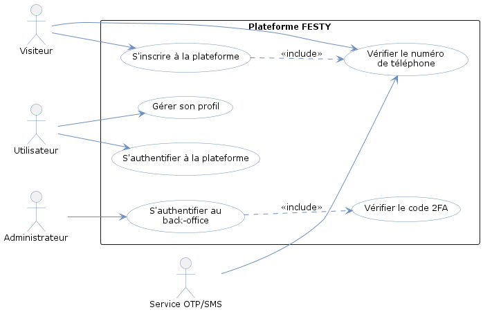

# Chapitre 3 : Étude et réalisation du Sprint 1 — Authentification et gestion des accès

## Introduction

Ce chapitre présente l’étude et la réalisation du premier sprint du projet FESTY. Ce sprint est consacré aux fonctionnalités de base liées à l’authentification, à l’inscription, à la vérification du compte, à la gestion du profil utilisateur et à l’accès au back-office administrateur.

Nous présentons d’abord le backlog du sprint, puis l’analyse fonctionnelle à travers le diagramme de cas d’utilisation et les descriptions textuelles des cas principaux. Ensuite, nous présentons la conception du sprint à l’aide des diagrammes de classes et de séquence. Enfin, nous exposons les principales interfaces réalisées.

## 3.1 Sprint Backlog

Le Sprint Backlog regroupe les user stories sélectionnées pour le premier sprint. Ces fonctionnalités constituent la base d’accès à la plateforme FESTY.

### 3.1.1 Objectif du sprint

L’objectif du Sprint 1 est de mettre en place un accès sécurisé à la plateforme, fondé sur l’authentification interne du Back-End FESTY, la gestion de sessions sécurisées et la vérification OTP. Il couvre l’inscription des visiteurs, la vérification du numéro de téléphone, l’authentification des utilisateurs, la gestion du profil et l’accès administrateur au back-office.

Ce sprint est essentiel, car les modules suivants dépendent de l’existence de comptes utilisateurs et d’un mécanisme d’authentification fiable.

### 3.1.2 Backlog du sprint

Le tableau suivant présente le backlog du premier sprint. Les user stories sont organisées selon les acteurs concernés, les tâches principales à réaliser, la priorité et l’estimation prévue.

| ID | User Story | Tâches principales | Priorité | Estimation |
|---|---|---|---|---|
| US-1.1 | En tant que visiteur, je veux créer un compte afin d’accéder aux fonctionnalités de la plateforme. | Créer l’interface d’inscription ; valider les champs ; déclencher la vérification du numéro de téléphone ; enregistrer les informations du compte. | Must Have | 3 jours |
| US-1.2 | En tant que visiteur, je veux vérifier mon numéro de téléphone afin de finaliser mon inscription. | Saisir le code OTP ; vérifier le code ; gérer le renvoi de l’OTP ; permettre le changement du numéro pendant l’inscription. | Must Have | 2 jours |
| US-1.3 | En tant qu’utilisateur, je veux m’authentifier à la plateforme afin d’accéder à mon espace personnel. | Créer l’interface de connexion ; vérifier les identifiants ; gérer la session utilisateur ; sécuriser l’accès aux fonctionnalités privées. | Must Have | 2 jours |
| US-1.4 | En tant qu’utilisateur, je veux gérer mon profil afin de consulter et mettre à jour mes informations personnelles. | Afficher les informations du profil ; modifier les informations personnelles ; modifier le mot de passe ; modifier le numéro de téléphone avec vérification OTP. | Must Have | 3 jours |
| US-1.5 | En tant qu’utilisateur, je veux réinitialiser mon mot de passe afin de récupérer l’accès à mon compte en cas d’oubli. | Créer le parcours de récupération ; envoyer et vérifier le code OTP ; enregistrer le nouveau mot de passe ; confirmer l’opération. | Should Have | 2 jours |
| US-1.6 | En tant qu’administrateur, je veux m’authentifier au back-office afin d’accéder à l’espace d’administration. | Créer l’interface de connexion administrateur ; vérifier les identifiants ; appliquer la vérification 2FA ; sécuriser l’accès au back-office. | Must Have | 2 jours |
| US-1.7 | En tant qu’administrateur, je veux réinitialiser mon mot de passe afin de récupérer l’accès au back-office. | Déclencher la récupération du mot de passe ; vérifier l’OTP administrateur ; enregistrer le nouveau mot de passe. | Should Have | 2 jours |

**Tableau 3.1 : Backlog du Sprint 1**

Les sous-fonctionnalités comme le renvoi de l’OTP, le changement du numéro pendant l’inscription et la vérification 2FA sont intégrées dans les parcours principaux d’inscription, d’authentification et de récupération du compte. 

## 3.2 Analyse fonctionnelle

L’analyse fonctionnelle du premier sprint permet de préciser les fonctionnalités liées à l’authentification et à la gestion des accès. Elle présente les interactions entre les acteurs concernés et le système, puis détaille les principaux cas d’utilisation réalisés durant ce sprint.

Les acteurs concernés par ce sprint sont le Visiteur, l’Utilisateur et l’Administrateur.

### 3.2.1 Diagramme de cas d’utilisation du Sprint 1

Le diagramme de cas d’utilisation du Sprint 1 présente les fonctionnalités réalisées dans le cadre de l’authentification et de la gestion des accès. Il permet de visualiser les cas d’utilisation associés à chaque acteur ainsi que les services intervenant dans certains scénarios, notamment la vérification OTP et l’accès sécurisé au système.

**Figure 3.1 : Diagramme de cas d’utilisation du Sprint 1**

La figure 3.1 présente les principaux cas d’utilisation du Sprint 1. Le tableau suivant en propose un raffinement synthétique.

| ID | Acteur principal | Cas d’utilisation | Sous-fonctionnalités associées |
|---|---|---|---|
| UC1.1 | Visiteur | S’inscrire à la plateforme | Vérifier le numéro de téléphone, renvoyer l’OTP, changer le numéro pendant l’inscription. |
| UC1.2 | Utilisateur | S’authentifier à la plateforme | Saisir les identifiants, accéder à l’espace personnel, se déconnecter. |
| UC1.3 | Utilisateur | Gérer son profil | Consulter le profil, modifier les informations personnelles, modifier le mot de passe, modifier le numéro de téléphone. |
| UC1.4 | Utilisateur | Réinitialiser le mot de passe | Demander la récupération du compte, vérifier le code OTP, définir un nouveau mot de passe. |
| UC1.5 | Administrateur | S’authentifier au back-office | Saisir les identifiants, vérifier le code 2FA, accéder à l’espace d’administration. |
| UC1.6 | Administrateur | Réinitialiser le mot de passe administrateur | Demander la récupération, vérifier l’OTP administrateur, définir un nouveau mot de passe. |

**Tableau 3.2 : Cas d’utilisation du Sprint 1**

Les sous-fonctionnalités présentées dans ce tableau ne seront pas décrites séparément afin d’éviter la redondance. Elles seront intégrées dans les scénarios nominaux ou alternatifs des cas d’utilisation principaux.

Les cas de réinitialisation du mot de passe sont mentionnés dans le tableau de raffinement. Le parcours de réinitialisation du mot de passe utilisateur est détaillé séparément, tandis que la réinitialisation administrateur reste intégrée au scénario alternatif de l’authentification au back-office afin d’éviter une description répétitive.

### 3.2.2 Description textuelle des cas d’utilisation

Dans cette section, nous présentons les descriptions textuelles des principaux cas d’utilisation du Sprint 1. Ces descriptions permettent de préciser les acteurs, les préconditions, les postconditions, le scénario nominal et les scénarios alternatifs.

| Élément | Description |
|---|---|
| Cas d’utilisation | S’inscrire à la plateforme |
| Acteur principal | Visiteur |
| Acteur secondaire | Service OTP/SMS |
| Objectif | Permettre à un visiteur de créer un compte utilisateur sur la plateforme FESTY. |
| Précondition | Le visiteur n’est pas authentifié et ne possède pas encore de compte actif. |
| Postcondition | L’utilisateur est enregistré avec le statut EN_ATTENTE_VERIFICATION, puis activé après validation du code OTP et vérification du numéro de téléphone. |
| Scénario nominal | 1. Le visiteur accède à l’interface d’inscription. 2. Il saisit ses informations personnelles, son email, son mot de passe et son numéro de téléphone. 3. Le système vérifie la validité des champs. 4. Le Back-End FESTY vérifie l’unicité de l’email et du numéro de téléphone. 5. Le Back-End FESTY crée le compte avec le statut EN_ATTENTE_VERIFICATION. 6. Le système génère un code OTP et l’envoie au numéro indiqué. 7. Le visiteur saisit le code OTP reçu. 8. Le système vérifie ce code. 9. Le système active l’utilisateur, valide le téléphone, génère une session sécurisée et confirme l’inscription. |
| Scénarios alternatifs | Champs invalides : le système demande la correction des informations. Email ou numéro déjà utilisé : le système refuse l’inscription et affiche une erreur. OTP incorrect : le système refuse la validation et demande un code valide. OTP expiré : le visiteur peut demander le renvoi d’un nouveau code. Numéro incorrect : le visiteur peut le modifier avant de relancer la vérification. |

**Tableau 3.3 : Description textuelle du cas d’utilisation « S’inscrire à la plateforme »**

| Élément | Description |
|---|---|
| Cas d’utilisation | S’authentifier à la plateforme |
| Acteur principal | Utilisateur |
| Objectif | Permettre à un utilisateur d’accéder à son espace personnel. |
| Précondition | L’utilisateur possède un compte enregistré sur la plateforme. |
| Postcondition | L’utilisateur est authentifié et accède aux fonctionnalités privées de la plateforme. |
| Scénario nominal | 1. L’utilisateur accède à l’interface de connexion. 2. Il saisit ses identifiants. 3. Le Back-End FESTY vérifie les identifiants. 4. Le système contrôle l’état du compte. 5. Le système génère une session sécurisée. 6. L’utilisateur accède à son espace personnel. |
| Scénarios alternatifs | Identifiants incorrects : le système affiche un message d’erreur et refuse l’accès. Compte non vérifié : le système demande la finalisation de la vérification du numéro de téléphone. Compte suspendu : le système refuse l’accès à la plateforme. Mot de passe oublié : l’utilisateur est redirigé vers le parcours de réinitialisation du mot de passe. |

**Tableau 3.4 : Description textuelle du cas d’utilisation « S’authentifier à la plateforme »**

| Élément | Description |
|---|---|
| Cas d’utilisation | Réinitialiser le mot de passe |
| Acteur principal | Utilisateur |
| Acteur secondaire | Service OTP/SMS |
| Objectif | Permettre à l’utilisateur de récupérer l’accès à son compte en cas d’oubli du mot de passe. |
| Précondition | L’utilisateur possède un compte enregistré sur la plateforme. |
| Postcondition | Le mot de passe de l’utilisateur est réinitialisé avec succès. |
| Scénario nominal | 1. L’utilisateur accède à l’interface de réinitialisation du mot de passe. 2. Il saisit son numéro de téléphone. 3. Le système traite la demande de récupération associée au numéro saisi. 4. Le système génère un code OTP et l’envoie par SMS. 5. L’utilisateur saisit le code OTP reçu. 6. Le système vérifie sa validité. 7. L’utilisateur saisit un nouveau mot de passe. 8. Le système enregistre le nouveau mot de passe. 9. Le système affiche un message de confirmation. |
| Scénarios alternatifs | Numéro introuvable : le système affiche un message générique pour éviter l’énumération des comptes. OTP invalide ou expiré : le système refuse la validation et demande un nouveau code. Trop de tentatives incorrectes : le système bloque temporairement la vérification. Nouveau mot de passe non conforme : le système demande la correction du champ. |

**Tableau 3.5 : Description textuelle du cas d’utilisation « Réinitialiser le mot de passe »**

| Élément | Description |
|---|---|
| Cas d’utilisation | Gérer son profil |
| Acteur principal | Utilisateur |
| Objectif | Permettre à l’utilisateur de consulter et de mettre à jour ses informations personnelles. |
| Précondition | L’utilisateur est authentifié. |
| Postcondition | Les informations du profil sont consultées ou mises à jour avec succès. |
| Scénario nominal | 1. L’utilisateur accède à son profil. 2. Le système affiche les informations personnelles de l’utilisateur. 3. L’utilisateur choisit de modifier ses informations. 4. Il saisit les nouvelles informations. 5. Le système vérifie les données saisies. 6. Le système enregistre les modifications. 7. Le système affiche une confirmation de mise à jour. |
| Scénarios alternatifs | Données invalides : le système affiche les erreurs de validation. Modification du mot de passe : le système demande l’ancien mot de passe avant d’enregistrer le nouveau. Modification du numéro de téléphone : le système peut demander une vérification OTP du nouveau numéro. |

**Tableau 3.6 : Description textuelle du cas d’utilisation « Gérer son profil »**

| Élément | Description |
|---|---|
| Cas d’utilisation | S’authentifier au back-office |
| Acteur principal | Administrateur |
| Acteur secondaire | Service de vérification à deux facteurs (2FA) |
| Objectif | Permettre à l’administrateur d’accéder de manière sécurisée à l’espace d’administration. |
| Précondition | L’administrateur possède un compte valide. |
| Postcondition | L’administrateur est authentifié et accède au back-office. |
| Scénario nominal | 1. L’administrateur accède à l’interface de connexion du back-office. 2. Il saisit ses identifiants. 3. Le système vérifie les identifiants. 4. Le système déclenche une vérification 2FA. 5. L’administrateur saisit le code de vérification. 6. Le système valide le code. 7. L’administrateur accède à l’espace d’administration. |
| Scénarios alternatifs | Identifiants incorrects : le système refuse l’accès et affiche un message d’erreur. Code 2FA incorrect : le système demande la saisie d’un code valide. Mot de passe oublié : l’administrateur peut lancer le parcours de récupération du mot de passe via une vérification OTP par email. |

**Tableau 3.7 : Description textuelle du cas d’utilisation « S’authentifier au back-office »**

## 3.3 Conception

La phase de conception permet de représenter la structure statique et le comportement dynamique des fonctionnalités réalisées dans le Sprint 1. Elle complète l’analyse fonctionnelle en décrivant les principales classes manipulées ainsi que les échanges entre les acteurs, les interfaces et le système.

Dans ce sprint, la conception se concentre sur les modules liés à l’authentification, à la vérification OTP, à la gestion du profil utilisateur et à l’accès sécurisé au back-office administrateur.

### 3.3.1 Diagramme de classes du Sprint 1

Le diagramme de classes du Sprint 1 présente les principales entités utilisées pour gérer les comptes, les profils, les sessions d’authentification, les codes OTP et l’accès administrateur. Il s’agit d’un diagramme partiel limité aux classes nécessaires aux fonctionnalités réalisées dans ce sprint.

**Figure 3.2 : Diagramme de classes du Sprint 1**

Comme le montre la figure 3.2, la gestion des accès repose principalement sur la classe Utilisateur, qui regroupe les informations d’identification, les données de profil et les éléments de statut du compte. Les classes VerificationOTP, DemandeReinitialisationMotDePasse, SessionAuthentification et VerificationDeuxFacteursAdmin permettent de représenter les mécanismes liés à la vérification du numéro de téléphone, à la récupération du mot de passe, à la gestion des sessions et à l’accès sécurisé au back-office.

### 3.3.2 Diagrammes de séquence

Les diagrammes de séquence permettent de représenter l’enchaînement des interactions entre les acteurs et le système pour les principaux scénarios du Sprint 1. Dans ce sprint, nous présentons les scénarios liés à l’inscription, à l’authentification utilisateur, à la réinitialisation du mot de passe, à la gestion du profil et à l’authentification administrateur.

| Diagramme | Cas représenté | Objectif |
|---|---|---|
| Diagramme de séquence 1 | S’inscrire à la plateforme | Représenter le processus d’inscription, depuis la création du compte utilisateur jusqu’à son activation après vérification OTP. |
| Diagramme de séquence 2 | S’authentifier à la plateforme | Représenter le processus de connexion d’un utilisateur à son espace personnel. |
| Diagramme de séquence 3 | Réinitialiser le mot de passe | Représenter le processus de récupération du compte à travers la vérification OTP et la définition d’un nouveau mot de passe. |
| Diagramme de séquence 4 | Gérer son profil | Représenter la consultation et la mise à jour des informations personnelles. |
| Diagramme de séquence 5 | S’authentifier au back-office | Représenter l’accès sécurisé de l’administrateur avec vérification 2FA. |

**Tableau 3.8 : Diagrammes de séquence du Sprint 1**

#### 3.3.2.1 Diagramme de séquence « S’inscrire à la plateforme »

Ce diagramme présente l’inscription d’un visiteur sur FESTY. Le visiteur saisit ses informations, puis l’interface vérifie les champs avant de transmettre la demande au Back-End FESTY. Le système crée le compte avec le statut EN_ATTENTE_VERIFICATION et envoie un code OTP pour vérifier le numéro de téléphone. Le diagramme inclut aussi les variantes de modification du numéro et de renvoi de l’OTP. Après validation du code, le système active l’utilisateur et confirme l’inscription.

**Figure 3.3 : Diagramme de séquence « S’inscrire à la plateforme »**

#### 3.3.2.2 Diagramme de séquence « S’authentifier à la plateforme »

Ce diagramme présente l’authentification d’un utilisateur sur FESTY. L’utilisateur saisit ses identifiants, puis l’interface transmet la demande au Back-End FESTY. Le système vérifie les identifiants, contrôle l’état du compte et génère une session sécurisée si l’accès est autorisé. En cas d’identifiants incorrects, de compte non vérifié ou de compte suspendu, l’accès est refusé avec un message adapté.

**Figure 3.4 : Diagramme de séquence « S’authentifier à la plateforme »**

#### 3.3.2.3 Diagramme de séquence « Réinitialiser le mot de passe »

Ce diagramme présente la récupération du compte en cas d’oubli du mot de passe. L’utilisateur saisit son numéro de téléphone, puis le système vérifie l’existence du compte et envoie un code OTP par SMS. Après validation du code, l’utilisateur définit un nouveau mot de passe. Le système l’enregistre puis confirme la réinitialisation.

**Figure 3.5 : Diagramme de séquence « Réinitialiser le mot de passe »**

#### 3.3.2.4 Diagramme de séquence « Gérer son profil »

Ce diagramme présente le processus de gestion du profil utilisateur. L’utilisateur authentifié accède à son profil, consulte ses informations personnelles, effectue les modifications nécessaires, puis le système vérifie les données saisies avant d’enregistrer les changements.

**Figure 3.6 : Diagramme de séquence « Gérer son profil »**

#### 3.3.2.5 Diagramme de séquence « S’authentifier au back-office »

Ce diagramme présente le processus d’authentification de l’administrateur au back-office. Après la vérification des identifiants, le système déclenche une vérification 2FA afin de renforcer la sécurité de l’accès à l’espace d’administration.

**Figure 3.7 : Diagramme de séquence « S’authentifier au back-office »**

## 3.4 Réalisation

Cette section présente les principales interfaces réalisées dans le cadre du premier sprint. Ces interfaces correspondent aux fonctionnalités liées à l’inscription, à la vérification OTP, à l’authentification, à la récupération du compte, à la gestion du profil et à l’accès au back-office administrateur.

### 3.4.1 Interface d’inscription

L’interface d’inscription permet au visiteur de créer un compte en saisissant ses informations personnelles et son numéro de téléphone. Après validation des champs, le Back-End FESTY crée le compte en attente de vérification et déclenche l’envoi d’un code OTP pour vérifier le numéro saisi.

### 3.4.2 Interface de vérification OTP

L’interface de vérification OTP permet ensuite au visiteur de saisir le code reçu. En cas d’expiration ou de non-réception du code, l’utilisateur peut demander le renvoi d’un nouveau code. Il peut également modifier son numéro de téléphone avant de relancer la vérification.

**Figure 3.8 : Interfaces d’inscription et de vérification OTP**

### 3.4.3 Interface de connexion utilisateur

L’interface de connexion permet à l’utilisateur de s’authentifier en saisissant ses identifiants. Après vérification des identifiants et de l’état du compte, le système autorise l’accès à l’espace personnel et aux fonctionnalités privées de l’application.

Cette interface constitue un point d’accès principal à la plateforme. Elle prévoit également un lien vers le parcours de réinitialisation du mot de passe en cas d’oubli.

**Figure 3.9 : Interface de connexion utilisateur**

### 3.4.4 Interface de réinitialisation du mot de passe

L’interface de réinitialisation du mot de passe permet à l’utilisateur de récupérer l’accès à son compte en cas d’oubli. Le processus repose sur la vérification du numéro de téléphone à travers un code OTP reçu par SMS, puis permet à l’utilisateur de définir un nouveau mot de passe.

Cette fonctionnalité renforce l’autonomie de l’utilisateur tout en conservant un niveau de sécurité adapté aux opérations liées au compte.

**Figure 3.10 : Interface de réinitialisation du mot de passe**

### 3.4.5 Interface de gestion du profil utilisateur

L’interface de gestion du profil permet à l’utilisateur authentifié de consulter ses informations personnelles et de les mettre à jour. L’utilisateur peut modifier ses données, son mot de passe ou son numéro de téléphone.

Lorsqu’une modification concerne une information sensible, comme le numéro de téléphone, une vérification supplémentaire peut être demandée afin de garantir la sécurité du compte.

**Figure 3.11 : Interface de gestion du profil utilisateur**

### 3.4.6 Interface d’authentification au back-office

L’interface d’authentification au back-office permet à l’administrateur d’accéder à l’espace d’administration de FESTY. L’accès est sécurisé par la vérification des identifiants et par un mécanisme de vérification renforcée de type 2FA.

Cette interface permet de protéger les fonctionnalités sensibles du back-office, qui seront utilisées dans les sprints suivants pour la supervision, la validation des partenaires, la modération et le suivi des opérations.

**Figure 3.12 : Interface d’authentification au back-office**

## Conclusion

Dans ce chapitre, nous avons présenté l’étude et la réalisation du premier sprint du projet FESTY, consacré à l’authentification et à la gestion des accès. Nous avons commencé par définir l’objectif du sprint et son backlog, puis nous avons détaillé l’analyse fonctionnelle à travers le diagramme de cas d’utilisation et les descriptions textuelles des principaux cas.

Nous avons ensuite présenté la conception du sprint à l’aide du diagramme de classes partiel et des diagrammes de séquence relatifs à l’inscription, à l’authentification, à la réinitialisation du mot de passe, à la gestion du profil et à l’accès au back-office. Enfin, nous avons exposé les principales interfaces réalisées durant ce sprint.

Ce sprint constitue une base essentielle pour les autres modules de la plateforme : création des comptes, vérification OTP, gestion des sessions sécurisées et gestion des profils. Le chapitre suivant sera consacré au Sprint 2, portant sur la gestion des partenaires et des événements.